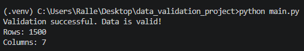
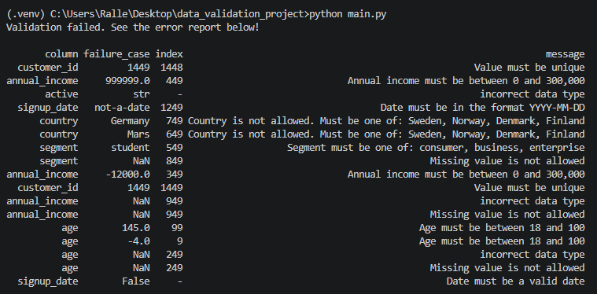
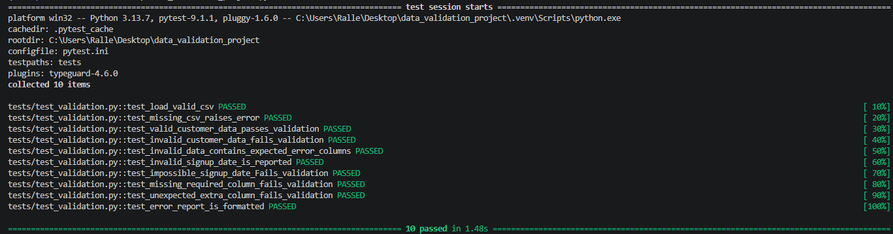

# Customer Data Validation with Pandera

## Syfte

Syftet med detta projekt var att fördjupa mig inom datavalidering i Python, med ett specifikt fokus på biblioteket Pandera.

Jag ville undersöka hur man kan kontrollera att en CSV-fil har rätt struktur och rimliga värden innan datan används vidare i en modell eller analys. Fokus låg därför på att skapa tydliga valideringsregler för bland annat obligatoriska kolumner, olika datatyper, saknade värden, tillåtna kategorier, numeriska intervall och datum.

Samt ville jag också förstå hur valideringen kan byggas på ett mer strukturerat sätt i ett lite mindre Pythonprojekt. Det var därför jag delade upp lösningen i flera moduler. Jag använde också pytest för automatiska tester och logging för att spara information om alla valideringskörningar.

Målet var inte att bygga ett komplett system eller en full ETL-pipeline utan att skapa en mindre fungerande lösning som tydligt visar hur datavalidering kan användas i praktiken.

## Området och dess relevans

Datavalidering är relevant inom Data Science eftersom analyser och modeller är beroende av att all indata har rätt struktur och en rimlig kvalitet.

I projektet används ett exempel med syntetisk kunddata från ett fiktivt nordiskt serviceföretag. Datan innehåller kund-id, ålder, årsinkomst, kundsegment, land, aktiv status och registreringsdatum.

Om en CSV-fil till exempel innehåller felaktiga datatyper, dubbla ID:n, oväntade kategorie, orimliga värden eller saknade kolumner så kan det påverka senare analyser efteråt. Ett valideringssteg kan därför användas som en kontroll innan datan går vidare i dataflödet.

Pandera passar bra för detta eftersom valideringsregler kan samlas i ett schema för en Pandas DataFrame. På så vis blir det tydligt vilka krav datan måste uppfylla och samma regler kan användas varje gång en ny fil ska kontrolleras.

För en Data Scientist eller dataanalytiker kan detta göra arbetsflödet säkrare och lättare att felsöka. Problem kan upptäckas tidigt i stället för först efter att datan redan använts i till exempel en rapport, modell eller en hel analys.

## Viktiga Begrepp

### Pandera och DataFrameSchema

Pandera är ett Pythonbibliotek för datavalidering som kan användas tillsammans med Pandas DataFrames.

I projektet används ett `DataFrameSchema` för att beskriva hur kunddatan förväntas se ut. Schemat är uppbyggt som ett slags datakontrakt där jag definierat vilka kolumner som ska finnas, vilka datatyper de ska ha och vilka regler värdena måste följa.

Exempel:

```python
"age": pa.Column(
    int,
    checks=Check.in_range(18,100),
    nullable=False,
)
```

Detta betyder att kolumnen age ska innehålla ett heltal, att värdena ska ligga mellan 18 och 100 samt att saknade värden inte är tillåtna.

### Checks

Pandera använder `Check` för att kontrollera att värden följer bestämda regler.

I projektet används bland annat:
- `Check.in_range()` för numeriska intervall
- `Check.isin()` för tillåtna kategorier
- `Check.str_matches()` för datumformat
- Samt en egen kontrollfunktion för att kontrollera att datum faktiskt är giltiga datum

Genom detta kontrolleras både datastrukturen och innehållet i kolumnerna.

### Lazy och strict validation

Validering körs med:

 ```python
 customer_schema.validate(data, lazy=True)
 ```

Med `lazy=True` samlar Pandera flera valideringsfel i samma körning istället för att stoppa direkt vid det första upptäckta felet. Detta passar perfekt eftersom den medvetet felaktiga CSV-filen innehåller flera olika typer av problem. Användaren får då en samlad felrapport och kan se flera problem på samma gång.

Schemat använder också `strict=True`, vilket gör att extra kolumner som inte finns definierat i schemat upptäcks.

Dessa två inställningar gör det möjligt att kontrollera både flera fel samtidigt och att CSV-filen följer den förväntade strukturen.

### Felhantering och felrapportering

När Pandera hittar problem kan det skapas ett `SchemaErrors`. I projektet fångas detta upp med `try` och `except`.

Istället för att bara visa en lång teknisk traceback omvandlas Panderas valideringsresultat till en enklare att läsa felrapport som visar bland annat vilken kolumn som har problem, vilket värde som orsakade felet och ett tydligare felmeddelande.

### Loggning och pytest

`pytest` används för automatiska tester av projektets viktigaste funktioner. Testerna används bland annat för att kontrollera att korrekt data godkänns och att olika typer av felaktig data upptäcks.

Python `logging` används för att spara information om varje valideringskörning. Till exempel vilken fil som kontrollerades och om validering lyckades eller misslyckades.

## Genomförande

Projektet byggdes stegvis för att göra varje del lättare att förstå och testa.

Jag började med att skapa två syntetiska CSV-filer med kunddata. Den ena filen innehåller korrekt data och den andra medvetna fel såsom saknade värden, orimliga värden, felaktiga datum med mera. Detta gjorde som sagt det möjligt att testa både ett normalt flöde där datan godkänns och ett felaktigt flöde där flera olika problem upptäcks.

### Projektstruktur

Koden delades upp i flera mindre Pythonfiler med olika ansvar:
- `main.py` fungerar som projektets startpunkt och samlar datainläsning, validering och utskrift av resultatet.
- `data_loader.py` ansvarar för att läsa in CSV-filen och kontrollera att filen finns.
- `schema.py` innehåller Pandera-schemat och valideringsreglerna.
- `validator.py` kör valideringen och skapar en mer läsbar felrapport i terminalen.
- `test_validation.py` innehåller automatiska tester med pytest.
- `pytest.ini` innehåller pytest konfiguration så att projektets moduler kan importeras korrekt när testerna körs.
- `__init__.py` markerar `src`-mappen som ett Pythonpaket och innehåller inte någon egen kod.

Denna uppdelning gjorde det enklare att hålla olika delar av logiken separerade och att testa funktionerna stegvis.

### Datainläsning och valideringsflöde

CSV-filen läses först in med Pandas genom en separat funktion i `data_loader.py`. Funktionen kontrollerar även att filen faktiskt finns. Om sökvägen är felaktig skapas ett tydligt `FileNotFoundError`, istället för att programmet fortsätter med en fil som inte finns.
Efter inläsningen skickas DataFramen vidare till validering. `validator.py` använder schemat från `schema.py` för att kontrollera att datan följer de regler som har definierats.

Flödet kan förenklat beskrivas så här:

```text
CSV file
   ↓
data_loader.py
   ↓
Pandas DataFrame
   ↓
Pandera schema
   ↓
validator.py
   ↓
Valid data / Error report
```

Om datan är korrekt går den igenom valideringen och programmet visar antal rader och kolumner. Om datan är felaktig samlas problemen i en felrapport som skrivs ut i terminalen.

### Viktiga tekniska val och stegvis förbättring

Valideringen byggdes ut stegvis för att det skulle vara lättare att förstå vad varje förändring gjorde och för att kunna testa att tidigare funktioner fortfarande fungerade.

Ett viktigt val var att använda `lazy=True` när Pandera kör valideringen. Utan detta kan valideringen stoppa vid det första felet. Med `lazy=True` samlas flera problem i samma körning. Detta var extra viktigt och passar bättre när en CSV-fil kan innehålla flera olika typer av fel samtidigt.

Jag valde också att använda `strict=True` i schemat. Det gör att extra kolumner som inte ingår i den förväntade strukturen upptäcks. På så vis kontrolleras inte bara innehållet i de olika kolumnera utan även att själva strukturen på filen är korrekt.

Datumvalideringen förbättrades också stegvis under projektets gång. Först kontrollerades endast att datumet hade formatet `YYYY-MM-DD` med `Check.str_matches()`. Det visade sig dock att ett värde kan ha rätt format utan att vara ett korrekt kalenderdatum. Därför la jag till en egen kontrollfunktion som använder `pandas.to_datetime()` för att kontrollera att datumet faktiskt tolkas som ett giltigt datum.

Felrapporteringen förbättrades också under arbetets gång. Panderas ursprungliga felmeddelanden innehåller mycket teknisk information och kan vara svåra att läsa direkt. Därför formateras valideringsfelen i `validator.py` till en enklare rapport med kolumn, felaktigt värde, radindex och ett tydligare felmeddelande om vad felet är.

Den tekniska informationen från Pandera behålls internt, men `main.py` visar bara de delar som är relevanta för själva användaren. Detta gör att valideringslogiken och presentationen av resultatet hålls separerade.

### Logging och automatiska tester

Python `logging` används för att spara en enkel historik över valideringskörningarna i `logs/validation.log`.

Loggen visar bland annat:
- vilken fil som validerades
- när valideringen startade
- om valideringen lyckades eller misslyckades

Själva valideringsfelen visas däremot i terminalen. Loggfilen används alltså främst för att kunna se vad som har körts tidigare medan terminalen visar resultatet från den aktuella körningen.

`pytest` användes under hela utvecklingen för att kontrollera att lösningen fortsatte fungera efter diverse förändringar.

Testerna kontrollerar att:
- en korrekt CSV-fil kan läsas
- en saknad fil ger `FileNotFoundError`
- korrekt data går igenom valideringen
- felaktig data underkänns
- ogiltiga datum upptäcks
- ett korrekt formaterat men omöjligt kalenderdatum upptäcks
- saknade obligatoriska kolumner upptäcks
- oväntade extra kolumner upptäcks
- felrapporten innehåller och formaterar den information som förväntas

Efter varje större förändring kördes testerna igen för att kontrollera att tidigare funktionalitet fortfarande fungerade. Den slutliga testkörningen innehåller 10 tester som alla går igenom.

## Resultat

Den färdiga lösningen kan läsa in en kundfil, validera datan mot Pandera-schemat och visa olika resultat beroende på om filen följer reglerna eller inte.

#### Korrekt data

När `valid_customers.csv` används går hela filen igenom valideringen utan fel och programmet visar då att datan är godkänd samt hur många rader och kolumner som filen innehåller.



Detta visar att lösningen kan hanterna en fil som följer det förväntade schemat och alla definierade valideringsregler.

### Felaktig data

När `invalid_customers.csv` används upptäcks flera olika typer av problem i samma körning.

Exempel på några av dessa fel som hittas är:

- duplicerade kund-ID:n
- ålder utanför det tillåtna intervallet
- saknade värden
- felaktig datatyp
- ogiltigt datumformat
- datum som inte kan tolkas som ett giltigt kalenderdatum

Tack vare `lazy=True` kan flera av dessa fel då samlas och visas samtidigt.



Felrapporten visar vilken kolumn som innehåller problemet, det felaktiga värdet, radens index och ett enklare att förstå felmeddelande.

### Automatiska tester

Projektet innehåller 10 automatiska tester med pytest.

Den slutliga testkörningen visar att alla tester går igenom:



Testerna visar bland annat att korrekt data godkänns, felaktig data underkänns och att olika struktur,datum och filfel upptäcks som förväntat.

I helhet visar resultatet att lösningen fungerar för det avgränsade användningsfallet jag valt.

## Begränsningar och möjliga förbättringar

Lösningen fungerar bra för det avgränsade exempel som projektet är byggt för, men den är fortfarande ganska enkel och har flera begränsningar som skulle bli tydliga i ett mer verkligt dataflöde.

Valideringsreglerna är hårt anpassade till just den syntetiska kunddatan jag arbetat med. Gränser för ålder, årsinkomst, tillåtna länder eller kundsegment är definierade direkt i schemat. Det gör just min lösning tydlig och lätt att förstå, men också mindre flexibel. Om reglerna ändras så behöver koden uppdateras.

Användningen av `strict=True` är både en styrka och en begränsning. Det gör att filens struktur kontrolleras noggrant men det innebär samtidigt att även en extra kolumn gör att valideringen misslyckas. I ett riktigt system kan detta vara onödigt strikt om datakällan förändras och börjar innehålla nya kolumner som egentligen inte påverkar resten av arbetsflödet.

Datumvalideringen kontrollerar format och att datumet faktiskt existerar i kalendern men reglerna är fortfarande ganska grundläggande. Ett datum i framtiden skulle till exempel kunna passera valideringen trots att det inte är rimligt som ett registreringsdatum idag. Det visar att tekniskt korrekt data inte alltid betyder att datan är rimlig ur ett verksamhetsperspektiv.

Min lösning hanterar dessutom bara en CSV-fil i taget och sökvägen väljs manuellt i `main.py`. Det fungerar för demonstrationen men är inte särskilt praktiskt om många filer ska kontrolleras regelbundet.

Logging-delen är också något begränsad. Loggfilen visar om en validering lyckades eller misslyckades men sparar inte den fullständiga felrapporten. Det gör att det är svårt att i efterhand analysera exakt vilka typer av problem som förekom i tidigare filer, utan att skriva ner eller ta en bild på terminalutskriften.

Därför skulle några möjliga förbättringar vara:
- flytta vissa valideringsregler till en separat konfigurationsfil för att göra dem enklare att ändra
- göra hanteringen av extra kolumner mer flexibel istället för att alltid använda `strict=True`
- lägga till fler verksamhetsregler som till exempel att ett registreringsdatum inte får ligga i framtiden
- låta användaren ange vilken CSV-fil som ska valideras när programmet startar, istället för att ändra sökvägen direkt i `main.py`
- göra det möjligt att validera flera filer i samma körning
- spara mer detaljerad information om tidigare valideringsfel i loggen
- på sikt stödja fler datakällor än CSV, som data från en databas eller ett API

## Koppling till yrkesrollen

Datavalidering är relevant för en Data Scientist eller dataanalytiker eftersom man ofta arbetar med data som kommer från olika filer, system eller andra källor.

Innan datan används i en modell, rapport eller en analys behöver man kontrollera att den ser ut som förväntat. Det kan till exempel handla om att rätt kolumner finns, att värden ligger inom rimliga gränser och att kategorier är korrekt formaterade.

I mitt projekt gör Pandera den kontrollen innan datan används vidare. Det minskar risken att fel upptäcks senare i arbetet, när de redan kan ha påverkat en analys eller ett resultat som redovisats.

Projektet visar också varför det är viktigt att skriva kod som är enkel att testa och felsöka. Genom att dela upp lösningen i flertalet moduler, använda pytest och få information direkt i terminalen blir det lättare att förstå vad som händer när något går fel.

För mig känns detta högst relevant för yrkesrollen. Det räcker inte alltid att bara kunna analysera data, utan man behöver också kunna kontrollera att datan går att lita på och följer de regler som gäller.

## Källor

**Pandera documentation**
Användes för att förstå hur `DataFrameSchema`, kolumner, datatyper, `Check`, `strict=True`, `validate()` och `lazy=True` fungerar i Pandera.
[https://pandera.readthedocs.io/en/stable/index.html](https://pandera.readthedocs.io/en/stable/index.html)

**pytest documentation**
Användes för att förstå hur automatiska tester skrivs och körs med pytest, som till exempel assertions och `pytest.raises()`.
[https://docs.pytest.org/en/stable/](https://docs.pytest.org/en/stable/)

**Pandas documentation**
Användes för arbetet med Pandas DataFrames, inläsning av CSV-filer och datumhantering med till exempel `pandas.to_datetime()` och `errors=coerce`.
[https://pandas.pydata.org/docs/](https://pandas.pydata.org/docs/)

**Python documentation - logging**
Användes för att förstå hur Python `logging` kan konfigureras och hur information om valideringskörningar kan sparas i en loggfil.
[https://docs.python.org/3/library/logging.html](https://docs.python.org/3/library/logging.html)

**Kursvideor**
För hjälp med logging, pytest och valideringsregler.

## Självreflektion

### 1. Vad lärde du dig som du inte kunde innan?

Det viktigaste jag har lärt mig är hur man kan bygga datavalideringen mer strukturerat i Python. Innan projektet hade jag inte arbetat mycket med Pandera eller tänkt på validering som en egen del av ett dataflöde.
Jag har också fått bättre förståelse för hur tester och loggning kan användas tillsammans med validering.

### 2. Vad var svårast att förstå eller genomföra?

Det svåraste var att få alla delar att fungera tillsammans på ett tydligt sätt. Det handlade inte bara om att skriva själva reglerna utan också om hur fel skulle hanteras, visas och testas. Att tänka ut bra testfall var också svårare än jag först trodde.

### 3. Vilket tekniskt val är du mest nöjd med och varför?

Jag är mest nöjd med att valideringen samlar flera fel i samma körning och sedan omvandlar dem till en mer lättläst felrapport. Det gör att användaren kan se flera problem i filen direkt istället för att rätta ett fel i taget och köra programmet på nytt. Jag tycker det blev tydligare och mer användbart än att bara visa Panderas ursprungliga tekniska felmeddelanden.

### 4. Vad hade du gjort annorlunda om du började om?

Om jag började om hade jag först skrivit ner mer exakt vilka regler som skulle kontrolleras och vilka typer av fel programmet skulle upptäcka. Under projektets gång lade jag till och förbättrade flera kontroller efter att jag sett hur valideringen fungerade i praktiken. Med den kunskap jag har nu hade jag kunnat definiera fler av dessa krav från början och sedan bygga schema och tester utifrån dem.

### 5. Vad skulle vara ett naturligt nästa steg om du fortsatte arbetet?

Nästa steg hade varit att utveckla lösningen så att felrapporten sparas efter varje körning och inte bara visas i terminalen. Rapporten skulle till exempel kunna sparas som en CSV eller JSON så att resultaten går att granska i efterhand. Jag hade också velat göra hela projektet mer generellt så att det på sikt kan hantera data från flera källor, exempelvis API:er, andra filformat eller databaser. Samt att inte behöva manuellt ändra fil i `main.py` konstant.

### 6. Vilket betyg tycker du själv att arbetet motsvarar – G eller VG?

Jag bedömer själv arbetet som VG men eftersom det är kort och enkelt så kan jag också se G.

### 7. Motivera din bedömning genom att koppla till kraven för G och VG nedan.

Jag tycker att projektet uppfyller G-kraven eftersom jag byggt en fungerande lösning, varit tydligt avgränsad och använt dokumentation för de verktyg som ingår.
Jag bedömer det som VG eftersom jag inte bara fått lösningen att fungera utan också försökt förstå hur och varför de olika delarna fungerar som de gör. Jag har gjort egna tekniska val, testat flera typer av fel, förbättrat lösningen stegvis och kunnat resonera kring både styrkor, begränsningar och möjliga förbättringar.
Jag tycker därför att projektet visar både praktisk användning och en djupare förståelse för datavalidering i Python.


Rasmus Svensson